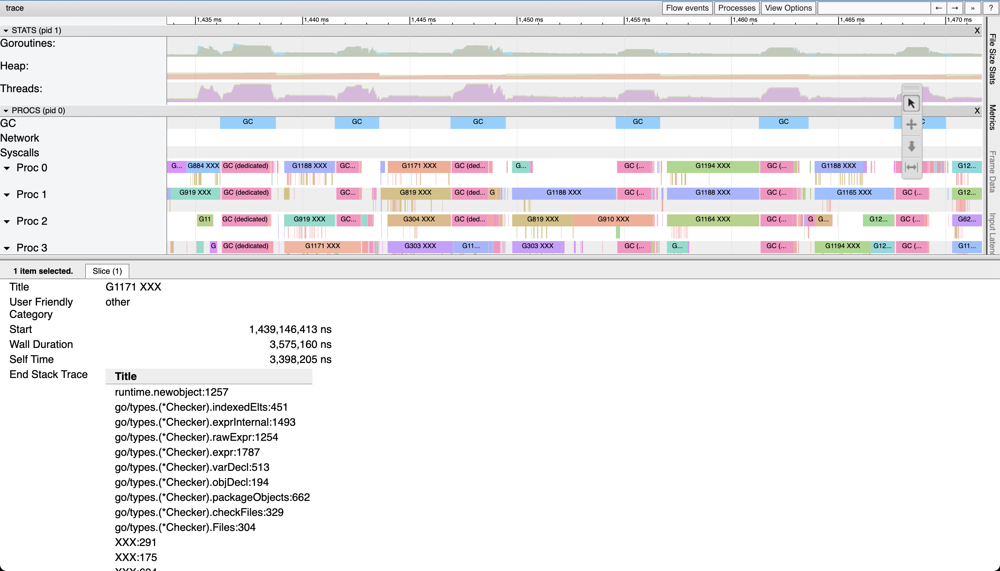

# traceutils

This repository contains code for decoding and encoding runtime/trace files as well as useful functionality implemented on top.

```
go install github.com/felixge/traceutils/cmd/traceutils@latest
```

Commands: [anonymize](#anonymize), [breakdown](#breakdown), [flamescope](#flamescope), [strings](#strings), [stw](#stw)

## anonymize

The anonymize command can be used to remove all file paths, function names and user logs from a trace file. The go stdlib is not anonymized, but all other packages are. This is useful for sharing traces that may contain sensitive information.

```
traceutils anonymize <input> <output>
```

Example output:



## breakdown

The breakdown command can be used to analyze the contents of a trace.

### bytes

```
traceutils breakdown bytes <input>
```

Example output:

```
+------------------------+----------+---------+
|       EVENT TYPE       |  BYTES   |    %    |
+------------------------+----------+---------+
| EventGoSched           | 235.9 kB | 35.88%  |
| EventGoStartLocal      | 193.8 kB | 29.48%  |
| EventHeapAlloc         | 81.6 kB  | 12.41%  |
| EventStack             | 44.1 kB  | 6.70%   |
| EventString            | 27.7 kB  | 4.22%   |
...
+------------------------+----------+---------+
|         TOTAL          | 657.5 KB | 100.00% |
+------------------------+----------+---------+
```

### count

```
traceutils breakdown count <input>
```

Example output:

```
+------------------------+--------+---------+
|       EVENT TYPE       | COUNT  |    %    |
+------------------------+--------+---------+
| EventGoStartLocal      |  61612 | 41.88%  |
| EventGoSched           |  58859 | 40.01%  |
| EventHeapAlloc         |  11801 | 8.02%   |
| EventGoPreempt         |   2354 | 1.60%   |
| EventGoSysCall         |   1791 | 1.22%   |
...
+------------------------+--------+---------+
|         TOTAL          | 147111 | 100.00% |
+------------------------+--------+---------+
```

### csv

```
traceutils breakdown csv <input>

```

Example output:

```
Event Type,Count,Bytes
EventGoStartLabel,596,4007
EventHeapAlloc,11801,81561
EventProcStart,1198,5381
EventGoStartLocal,61612,193841
EventGoSysCall,1791,7069
...
```

## flamescope

Extract CPU samples from a trace and convert them to a format suitable for [FlameScope](https://github.com/Netflix/flamescope).

```
traceutils flamescope <input> <output>
```

See [FlameScope for Go](https://blog.felixge.de/flamescope-for-go/) blog post for more details.

Example output:


## strings

Prints all strings contained inside of a trace. This is useful for verifying the output of anonymize.

```
traceutils strings <input>
```

Example output:

```
Not worker
GC (dedicated)
GC (fractional)
GC (idle)
runtime.asyncPreempt
XXX/src/runtime/preempt_arm64.s
XXX
XXX.go
```

## stw

List all stop-the-world events in a trace.

### top

```
traceutils stw top <input>
```

Example output:

```
+-----------+--------------+-------------------+------------+
| DURATION  |    START     |       TYPE        | PERCENTILE |
+-----------+--------------+-------------------+------------+
| 154.912µs | 227.279429ms | mark termination  |     100.00 |
| 89.376µs  | 504.95696ms  | mark termination  |      97.62 |
| 70.128µs  | 200.131507ms | mark termination  |      95.24 |
| 64.912µs  | 214.2521ms   | sweep termination |      92.86 |
| 62.544µs  | 224.908853ms | sweep termination |      90.48 |
...
| 18.784µs  | 2.323248ms   | sweep termination |       2.38 |
+-----------+--------------+-------------------+------------+
```

### csv

```
traceutils stw csv <input>
```

Example output:

```
Start (ms),Duration (ms),Type
2.323248,0.018784,sweep termination
2.777536,0.061712,mark termination
7.065904,0.020464,sweep termination
7.808416,0.034032,mark termination
...
504.956960,0.089376,mark termination
```

# License

MIT
